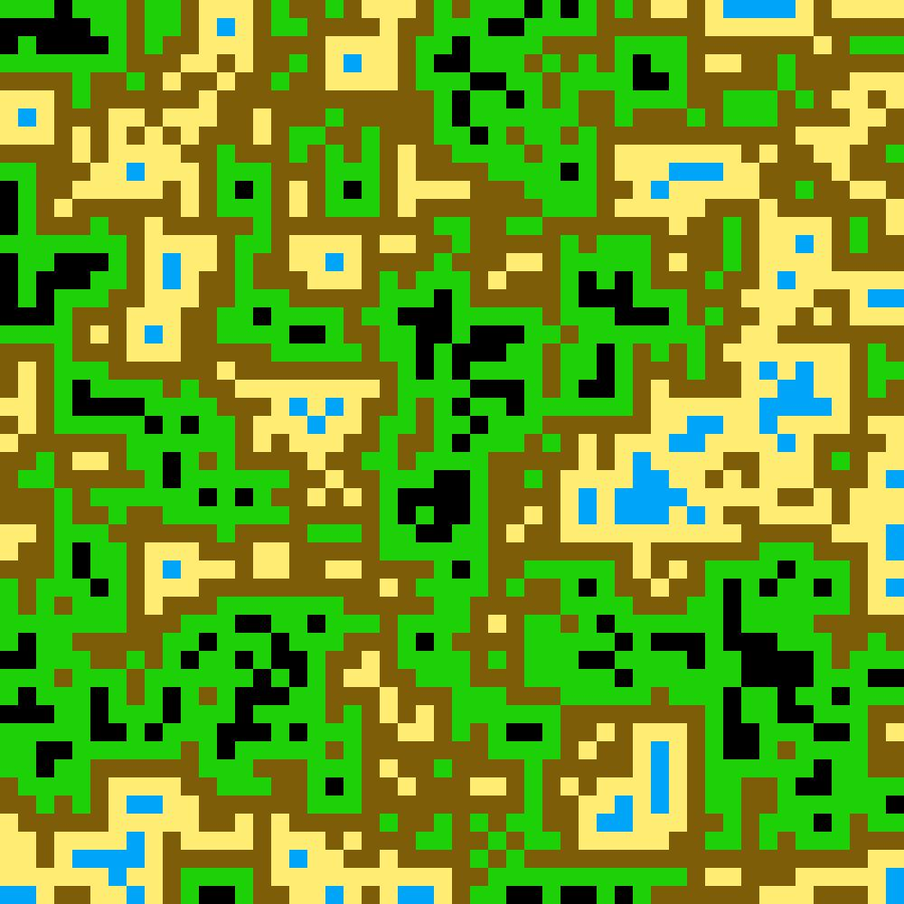
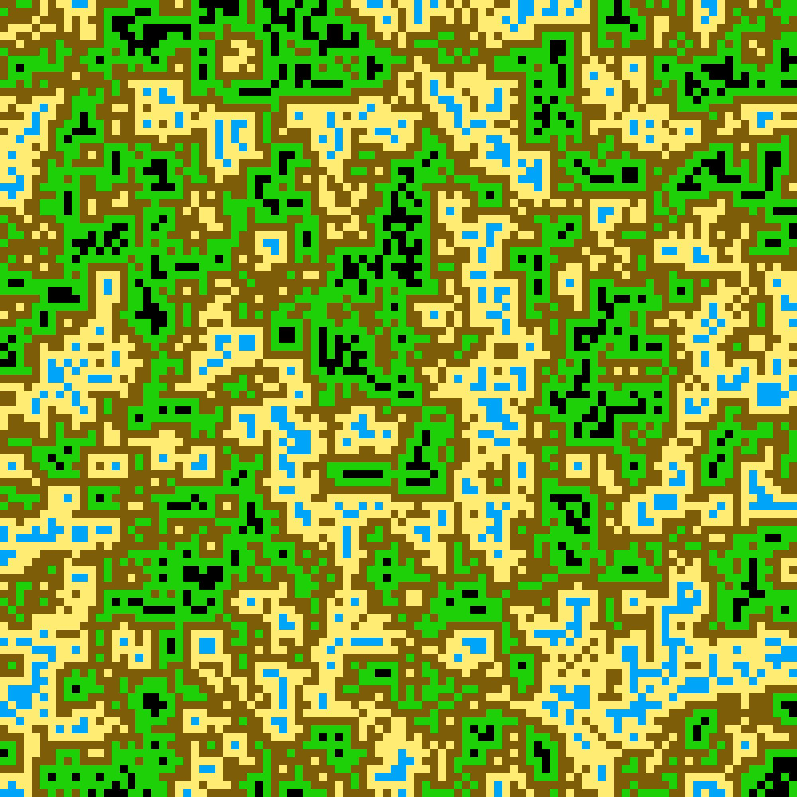

# Wave Collapse Map Generations 🗺

This is a project I wanted to try because I am interested in computers randomly performing task for us. The basic idea is you give the computer a 2d map and it will make a randow tile layout. The themes of this project so far are OPP, Pointers and C++.

## Step - 1 😊 C++ / FINISHED 
The C++ is finally finished. It took a while I had to take a break and come back because my previous approach was not working.(or rather it was to overcomplicated) so i 
I slimed down my appoarch. I still have the same 2 classes "*Node*" and "*Map*". 

### Node
 The node class is node that points to all co-ordinates that are other node and a master node called "*sur_Node*" that point to the other 8 nodes. and has a state and 
anti state. State beging the possible values the node could be and the anti state being what it can't be. The node also have alot of helper function the standard 
getters and setters for the private values such as the node state and anti_state. 

</br>

```
   public:
        Node* North;
        Node* North_East;
        Node* East;
        
        Node* West;
        Node* North_West;

        Node** sur_Node;
```

  A difference form my original appoarch is that I added 2 new functions "*checkState()*" and "*updateState(Node* node)*". Checkstate is used to update the sur_Nodes
states base on the change of the current node for example if the node became a 3 then the surrond state should be a {2,3,4} and their anti_states a {1,5}. 
The differnce of this approach was that i was try to have to map change the sur_node state but it is alot easier to do it locally.

</br>

### Map
  The map obj was were some complications arouse. I create a consturctor to make a 2d array based on a user input for size but I was creat in the pointer incorrectly.</br>
  ```
  obj*  arr  = new obj[10]   👎 ❌ 
  obj** arr = new obj*[10]   👍 ✔
  ```
  The map is alot simpler all the hard work is done in the node class (aka the updating of the surronding nodes). The only job the map has is to create the 2d map and start the wave collapse. The wave is now inside of a while loop -> when a position is choosen then the wave start and it update around the node base on that change.
  
</br>

```
   [{1,2,3} {1,2,3} {1,2,3}]                          [{1,2,3} {1,2,3} {1,2,3}]
   [{1,2,3} {1,2,3} {1,2,3}]                          [{2,3}    {2,3}    {2,3}]  
   [{1,2,3} {1,2,3} {1,2,3}]                          [{2,3}     {3}     {2,3}]  
   [{1,2,3} {1,2,3} {1,2,3}]                          [{2,3}    {2,3}    {2,3}]  
   [{1,2,3} {1,2,3} {1,2,3}]                          [{1,2,3} {1,2,3} {1,2,3}]
   
```

</br>
</br>
</hr>

### Example 
  This is an example of a generated map. It was generated with 50 x 50 nodes (2500 nodes) and the pixels imgs was added with python. The rules are set as below;
<div style = "width: 100%;">
  

  

  

  

  
</div>





# Where to next
- html css and java.
